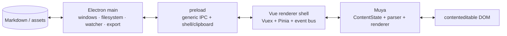
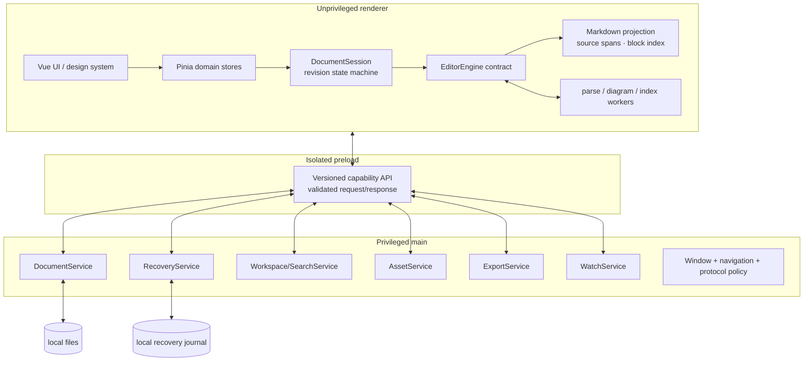
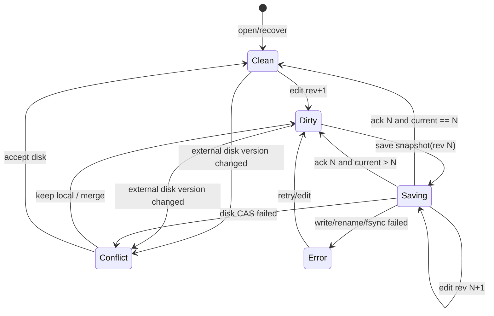

# Vien → Typora 级 Markdown 阅读编辑器执行计划

> 状态：提案 / 可执行路线图
> 审计日期：2026-07-15
> 审计基线：`chore/pinia-migration-phase-1`，`c1de9851`（v0.17.5）及当时工作区中的迁移改动
> 适用范围：桌面端编辑器、工作区、文件与恢复、导出、桌面安全、质量体系和发布工程
> 产品代号：本文沿用仓库产品名 **Vien**；“Typora 级”表示质量、完整度和使用流畅度的标杆，不表示复制 Typora 的界面、代码或商业功能。

这不是一张功能愿望清单，而是一份交付合同。每个阶段只有在数据、性能、测试和安全门槛同时通过后才算完成。计划首先修复会影响用户信任的基础问题，再扩展能力；不会用更多功能掩盖潜在的数据丢失、格式改写或安全债务。

---

## 1. 一页结论

### 1.1 产品北极星

把 Vien 做成一款 **安静、本地优先、无损、即时响应** 的 Markdown 阅读编辑器：用户可以像在普通文档应用里写作，又始终确信磁盘上的 Markdown 是可携带、可审查、不会被偷偷重写的纯文本。

核心承诺只有五条：

1. **内容可信**：未经用户操作不改文件；保存原子化；崩溃、断电、云盘冲突都不静默丢字。
2. **Markdown 可信**：所见即所得不是以格式归一化为代价；未编辑源片段保持原样；源代码模式与可视模式共享同一个事实来源。
3. **操作即时**：普通文档无感，大文档可预测降级；输入、选择、撤销、搜索和切换不被全量序列化阻塞。
4. **本地优先**：阅读和编辑默认不联网；任何远程渲染、上传或诊断都显式、可关闭、可解释。
5. **桌面完成度**：文件夹、标签页、目录、搜索、图片、主题、导出、恢复、快捷键和无障碍不是外围功能，而是完整体验的一部分。

### 1.2 总体判断

Vien 已经拥有一个功能面相当丰富的起点：Muya 可视编辑、CommonMark/GFM 测试、表格、数学、图表、脚注、前置元数据、源码模式、标签页、文件树、搜索、主题和 PDF/HTML 导出都已存在。正确策略不是推倒重来，而是：

1. 先把迁移期间失效或降级的桌面能力、保存链路和安全边界修到可证明可靠；
2. 用 `EditorEngine` 适配层、无损语料和性能基准把 Muya 隔离起来；
3. 给 Muya 四至八周的量化改造窗口；
4. 只有它无法通过无损、IME 和大文档门槛时，才在适配层后更换编辑内核；
5. 在可信内核上补齐工作区、恢复、导出、可访问性和 macOS 原生打磨。

### 1.3 里程碑与估算

| 里程碑 | 目标 | 计划周 | 必须满足的结果 |
| --- | --- | ---: | --- |
| M0 可重复基线 | 构建、测试、能力清单、ADR、性能基线 | 2 | 干净环境一条命令可复现；不再有静默空实现 |
| M1 可信 Alpha | 安全 IPC、文件服务、原子保存、恢复、冲突模型 | 12 | 故障注入下无静默丢失，桌面权限边界收紧 |
| M2 日用 Beta | 无损编辑核心、IME、表格/图片/链接、性能达标 | 26 | 核心语料 100% 无损，关键编辑矩阵全绿 |
| M3 功能完整 RC | 工作区、搜索、阅读模式、资源、导出、主题 | 38 | Typora 级核心能力矩阵无 P0/P1 缺口 |
| M4 1.0 | 可访问性、macOS 发布和长稳 | 47 | 全部发布闸门通过，可安全回滚和恢复 |

估算基于 4–6 人稳定团队，约 9–12 个月；单人全职更现实的范围是 15–20 个月，日用 Beta 约 4–6 个月。它们是容量估算，不是日期承诺；每个阶段以退出条件而非日历宣告完成。

---

## 2. “Typora 级”在本项目中的定义

### 2.1 对标的是体验闭环，不是像素复制

Typora 的价值不只是隐藏 Markdown 标记，而是把以下环节连成一个稳定闭环：

- 单窗格即时预览与源码可控性；
- 标题、列表、任务、表格、代码、数学、脚注、图片等常用语法的直接操作；
- 文件树、目录、快速打开、全局搜索和最近工作区；
- 自动保存、会话恢复、草稿和外部修改处理；
- 图片复制/移动/上传策略、主题、打印与导出；
- 键盘优先、专注/打字机模式、macOS 原生桌面行为；
- 用户不需要理解编辑器内部模型，也不会因为使用可视编辑而损坏 Markdown。

Vien 1.0 应达到这一闭环，同时保留自身“Calm Markdown for long-form writing”的视觉身份。现有浅色空白页体现出的安静、留白和长文阅读感应该延续；旧式高密度 MarkText 外壳只作为功能参考，不应成为视觉回退方向。

### 2.2 1.0 的硬性质量指标

以下指标在 Phase 0 固化基准机、语料版本和采集方法后成为 CI/发布合同。表中的数值是首版目标，若基准显示不合理，可通过 ADR 调整一次，但不能在发布前临时放宽。

| 维度 | 1.0 目标 | 测量方式 |
| --- | --- | --- |
| 未修改文件 | 打开、浏览、关闭不写盘；显式保存未修改文件时 SHA-256 100% 相同 | 多编码/EOL/语法金库 |
| 局部修改 | 除用户事务命中的源区间外，其他字节不变；只有显式“格式化/转换 EOL”可全局改写 | source-span diff + property tests |
| 语法兼容 | 支持范围内 CommonMark/GFM 规范用例全绿；Vien 扩展有独立规范与回归语料 | 规范测试 + golden corpus |
| 保存安全 | 原子替换；旧磁盘版本不被无提示覆盖；保存中继续输入不会被旧响应标记为已保存 | 文件系统故障注入与版本竞态测试 |
| 恢复 | 编辑中强杀进程的恢复点 RPO ≤ 2 秒；恢复内容可预览、另存、丢弃 | kill/power-loss 模拟 1,000 轮 |
| 输入响应 | 100 KB 文档 input-to-paint p95 ≤ 35 ms；1 MB p95 ≤ 50 ms；30 秒连续输入无 >100 ms 编辑器长任务 | 固定脚本 + Chromium trace |
| 打开文档 | 参考机上 1 MB p95 ≤ 750 ms；10 MB p95 ≤ 2.5 s，并显示可操作进度或安全降级 | 冷/热启动基准 |
| 启动 | 参考机冷启动至可输入 p95 ≤ 2.0 s | 30 次自动采样 |
| 内存 | 空闲单窗 ≤ 300 MB；1 MB 文档 ≤ 450 MB；50 次开关文档后增长 ≤ 5% | RSS/heap 采样 |
| 工作区搜索 | 50,000 个 Markdown 文件中首批结果 p95 ≤ 300 ms，完整结果 ≤ 2 s；可取消且不阻塞输入 | 固定 2 GB 工作区 |
| 导出 | 标准金库 HTML/PDF golden 无非预期差异；链接、图片、数学、图表、目录和分页均有断言 | DOM diff + PDF 图像/结构检查 |
| 可访问性 | 核心流程符合 WCAG 2.2 AA：全键盘可达、无键盘陷阱、焦点可见、语义与对比度通过 | axe + Playwright + 人工读屏 |
| 安全 | Electron 安全清单全绿；无通用 IPC/任意 shell 暴露；默认无隐式文档联网 | 静态检查 + 渗透用例 |
| 稳定性 | Beta 群体无已知 P0；P1 崩溃/数据问题为 0；连续 8 小时 soak 无不可恢复错误 | soak、崩溃恢复、issue gate |

参考机为 MacBook Air M1/8 GB/SSD，并记录受支持的 macOS 版本。机器、OS、电源模式和语料都要版本化，避免“在我的电脑上很快”成为性能标准。

### 2.3 1.0 明确不做

- 实时多人协作、账号体系、云同步服务；
- 移动端和 Web 完整版；
- AI 写作或默认上传文档内容；
- 插件市场和不受信任的任意代码插件；
- 逐像素复制 Typora 或兼容其私有实现；
- 为追求“架构纯度”一次性重写全部 Vue、Muya 或主进程；
- 承诺所有 Pandoc 格式内置可用；未安装外部工具时必须清楚解释能力边界。

这些能力可进入 1.x/2.0 评估，但不能稀释 1.0 的数据安全和编辑质量。

---

## 3. 当前仓库事实基线

### 3.1 技术与规模

| 区域 | 当前状态 | 结论 |
| --- | --- | --- |
| 桌面壳 | Electron 34、electron-vite/Vite、electron-builder | 基础现代化已发生，但安全配置和迁移兼容层需要收口 |
| UI | Vue 3.5、Element Plus、mitt | 可继续演进，不需要更换框架 |
| 状态 | Vuex 4 与 Pinia 3 并存，约 22 个 renderer 文件仍使用 Vuex 模式 | 必须按领域迁移，禁止长期双写 |
| 编辑器 | Muya + `ContentState` + 自有 Markdown parser/render/export | 功能丰富，但全量派生、可变树和源码归一化是核心风险 |
| 源码模式 | CodeMirror 5 | 可保留过渡，后续通过编辑引擎接口评估 CM6 |
| 质量 | TypeScript、Biome、Vitest、Playwright、CommonMark/GFM specs | 有好基础，但数据故障、IME、导出和真实桌面能力覆盖不足 |
| 代码规模 | `src` 约 55k LOC；约 130 JS / 185 TS / 45 Vue 文件 | 适合渐进式分层，不适合大爆炸重写 |

代码知识图谱显示约 4,300 个节点和 10,043 条关系。Muya、renderer 和 main 都是清晰边界，但跨层能力仍大量通过动态事件、Vuex action 和 IPC 字符串连接，静态可追踪性有限。

### 3.2 已验证的质量基线

审计时在保留现有 `node_modules` 的前提下直接调用本地二进制，得到：

| 检查 | 结果 |
| --- | --- |
| TypeScript `tsc --noEmit` | 通过 |
| Vitest | 22 个文件、557 个测试通过 |
| CommonMark / GFM spec runner | 脚本退出 0；后续审计确认旧 runner 未等待异步任务且没有回归断言，不能据此认定规范全绿 |
| Biome | 403 个文件通过 |
| electron-vite production build | 通过；renderer 处理约 4,457 modules |
| Playwright Electron E2E | 8/8 通过 |

这证明仓库有可工作的基线，但不能等同于产品级可靠性：现有 E2E 数量很少，且没有覆盖下面列出的静默空实现、保存故障、崩溃恢复和复杂 IME。另一个可复现性信号是：当前环境的 pnpm 11 与既有 `node_modules` 元数据不一致，`pnpm run` 会请求交互式清理；同时仓库保留 `pnpm-lock.yaml` 与 `yarn.lock`，旧 `build.yml` 仍使用 Yarn、Node 16 和不存在的 `build:bin`，而发布工作流使用 pnpm/Node 22。Phase 0 必须统一这一事实来源。

生产构建虽然成功，但当前主 renderer chunk 约 7 MB，CSS 约 643 KB，并包含约 3.3 MB 的 ELK、1.66 MB 的 Vega、约 1.2 MB 的 mindmap 等重模块。这不是立刻阻断发布的问题，却明确解释了为什么图表、语言包和导出能力需要按需加载。

### 3.3 已有能力盘点

Vien 不是从零开始。以下资产应当保留并加固：

- 单窗格可视 Markdown 编辑、源码模式、撤销/重做、查找/替换；
- 标签页、侧边栏、文件树、目录、快速打开和全局搜索入口；
- 标题、引用、列表、任务、表格、代码围栏、链接、图片、脚注；
- YAML/TOML/JSON front matter、原始 HTML、emoji；
- KaTeX 数学、Mermaid、flowchart、sequence、PlantUML、Vega-Lite 等图表；
- 表格行列增删、拖动等可视操作；
- 专注模式、打字机模式、自定义快捷键、命令面板；
- 编码、EOL、尾随换行、RTL、拼写检查和主题偏好；
- HTML/PDF/打印导出，以及通过 Pandoc 的外部格式导入/导出入口。

### 3.4 按优先级排序的真实缺口

#### P0：迁移后的桌面能力可能静默失效

[`electron.vite.config.ts`](electron.vite.config.ts) 把 renderer 中的 `fs`、`fs/promises`、`fs-extra`、`child_process` 和 `vscode-ripgrep` 映射到浏览器 stub。当前这些 stub 会返回空值、空路径或 no-op；但 renderer 仍在以下路径调用对应能力：

- [`src/renderer/util/fileSystem.ts`](src/renderer/util/fileSystem.ts)：创建、复制、移动、重命名、删除、图片搬运/上传、自定义命令；
- [`src/renderer/util/pdf.ts`](src/renderer/util/pdf.ts)：自定义导出主题读取；
- [`src/renderer/commands/quickOpen.js`](src/renderer/commands/quickOpen.js) 和侧边栏搜索：ripgrep/子进程；
- 导出设置：主题目录枚举。

静态调用链表明这些路径会落入空实现，应视为活动回归，直到真实 Electron E2E 证明相反。修复方式不是恢复 renderer 的 Node 权限，而是把每项能力迁到主进程中的显式、可校验服务，并让未知 Node import 在构建时失败。

#### P0：保存不是事务，恢复也尚未实现

[`src/main/filesystem/markdown.js`](src/main/filesystem/markdown.js) 仍有 `safeSaveDocuments` 的临时文件 + rename TODO，当前写入不是原子替换。会话/恢复目录在 [`src/main/app/paths.js`](src/main/app/paths.js) 里仍是 TODO；`startUpAction: lastState` 没有形成完整的会话恢复流程。

这意味着进程崩溃、磁盘满、权限变化和断电都没有系统性的恢复保证。对编辑器而言，这是发布阻断项。

#### P0：保存响应和“已保存”状态没有版本语义

[`src/renderer/store/editor.js`](src/renderer/store/editor.js) 同时负责标签页、文档内容、dirty 状态、光标、历史、目录、自动保存、冲突和导出。自动保存携带内容快照，但异步成功响应可能在用户产生新编辑后返回；没有 `revision` 比较时，旧响应可能把新内容错误标为已保存。编码/EOL 偏好和外部变更也散落在同一巨大模块中，难以证明状态完整性。

#### P0：可视编辑不是无损模型

[`src/muya/lib/index.ts`](src/muya/lib/index.ts) 的输入路径会调用 `getMarkdown()` 全量序列化，再派生字数、光标、历史和目录；`setMarkdown()` 则把文本导入块树、重渲染并触发 change。Markdown exporter 会规范化表格、列表标记、空白等表示形式。

当前 editor store 通过全局 `_suppressDirtyCount` 抑制加载后的“伪修改”，这说明导入/导出回环不是身份变换。全局计数器跨标签页共享，还可能在并发加载时相互干扰。Typora 级产品必须把源文本当作事实来源，而不是每次从语义树重建整个文件。

#### P0：Electron 边界仍然过宽

[`src/main/config.js`](src/main/config.js) 为编辑与偏好窗口配置了 `contextIsolation: true`、`nodeIntegration: false`，这是正确基础；但仍设置 `webSecurity: false`，也没有把 Electron 当前默认启用的 renderer sandbox 显式锁定并纳入回归测试。预加载 [`src/main/preload.ts`](src/main/preload.ts) 暴露通用 `ipc.send/invoke/on` 以及较宽的 shell/clipboard 能力，主进程多数 handler 缺少统一的 payload schema、sender/窗口身份验证和能力级授权。

编辑器会处理原始 HTML、外部图片、链接和图表，因此不能把内容视为可信页面。恢复 `webSecurity`、定制协议、CSP、导航拦截和窄 IPC 必须早于扩展网络能力。

#### P1：Muya 热路径复杂且经常全量工作

- `ContentState.getBlock` 递归扫描树且调用面很大；应改为稳定 block id → block 的索引；
- 历史记录深拷贝整棵块树，输入变更还会全量导出 Markdown；
- `collectLabels` 等部分渲染路径仍遍历整文档；
- 输入、表格、复制剪切和 tab 控制器含高复杂度、多层循环；
- `inputCtrl` 中存在模块级计时器，多个编辑实例之间可能串扰；
- mutation observer 能发现部分崩坏，却没有产品级自动恢复与诊断闭环。

这不是“代码不好看”的问题，而是输入延迟、选择错误、IME 边界和大文档崩溃的直接风险。

#### P1：文件监听靠时间窗口猜测写入来源

[`src/main/filesystem/watcher.js`](src/main/filesystem/watcher.js) 在 macOS 使用 polling，并通过时间窗口/路径启发式抑制自身写入；外部变化通常重新读取完整文件并经 IPC 发送。rename/重新 watch 仍有 TODO。iCloud、OneDrive、Dropbox、网络盘、原子 rename 和大小写变化会让这一模型产生误报、漏报或覆盖冲突。

#### P1：导出能力丰富但不够确定

HTML 导出会再次解析 Markdown，在隐藏 DOM 中渲染图表后序列化；PDF 借助活跃窗口中的隐藏打印容器和 `printToPDF`。自定义主题受 fs stub 影响，PDF 页码尚不支持，字体/资源/网络图表会造成不确定输出。PlantUML 当前默认指向公共服务，存在隐私、离线和供应链边界。

#### P1：质量体系覆盖面与功能面不匹配

557 个单元测试和规范测试是优势，但缺少：

- 未编辑字节相同与局部 source-span diff；
- 中文、日文、韩文 IME 和 macOS dead keys；
- 表格/列表/链接/图片跨块选择与撤销组合；
- 磁盘满、EACCES、rename 失败、进程强杀、旧保存响应；
- 云盘/外部修改/rename/删除冲突；
- PDF/HTML golden、主题和字体；
- 真实文件操作、全局搜索、快速打开的 Electron E2E；
- 安全、可访问性、性能和长时间 soak。

#### P2：产品壳、状态迁移和 macOS 发布尚未收口

Vuex/Pinia 并存、旧 CI 与新 release workflow 分裂、两个 lockfile、CodeMirror 5、历史 MarkText UI 与新的 calm surface 共存。它们都需要处理，但不能越过前述 P0 数据问题抢占优先级。

---

## 4. 当前链路与根因

### 4.1 当前运行架构



典型文档生命周期是：

1. main 创建 EditorWindow，通过 `mt::bootstrap-editor` 把文件/窗口状态送入 renderer；
2. renderer 建立 Muya，`setMarkdown()` 把文本解析为可变 block tree 并渲染；
3. DOM input 进入 `ContentState`，随后 `dispatchChange()` 全量获取 Markdown、历史、字数、光标和 TOC；
4. `LISTEN_FOR_CONTENT_CHANGE` 更新 Vuex dirty/auto-save 状态；
5. renderer 经 IPC 请求 main 写入；main 转换 EOL 后直接写文件；
6. watcher 再观察磁盘变化，并用时间启发式判断是自身保存还是外部修改。

### 4.2 根因不是“缺功能”，而是四个事实来源冲突

当前系统同时存在四种事实来源：

- 磁盘上的 Markdown 字节；
- renderer store 中的字符串；
- Muya 的 block tree；
- contenteditable DOM。

它们之间通过全量导入/导出、异步事件和 suppress 标志保持“差不多一致”，却没有版本号、事务或源区间约束。任何一个异步响应、格式化动作或外部写入都可能让另一个状态过期。

目标架构必须明确：**源文本缓冲区是内容事实来源，`DocumentSession` 是状态事实来源，磁盘版本由主进程持有；DOM 和语义树只是可重建投影。**

---

## 5. 目标架构

### 5.1 分层原则



边界规则：

1. renderer 不 import Node 文件系统、子进程、Electron 或 ripgrep 包；
2. preload 不暴露通用 `send/invoke/on`，只暴露版本化能力方法；
3. 每个请求都有 schema、`requestId`、窗口/会话身份和可取消语义；
4. main 是磁盘、进程、shell、打印和 watcher 的唯一权限拥有者；
5. store 只管理产品状态，不承担 parser、磁盘和导出实现；
6. editor engine 不知道 Electron，也不直接写 Pinia/Vuex；
7. 长耗时解析、索引和图表渲染移入 worker，且可取消；
8. 所有远程访问都通过显式策略层，默认关闭或明确提示。

### 5.2 `DocumentSession`：版本化状态机

文档会话至少包含：

```ts
type DocumentRevision = number

interface DiskVersion {
  mtimeMs: number
  size: number
  contentHash?: string
}

interface DocumentSession {
  id: string
  path: string | null
  revision: DocumentRevision
  savedRevision: DocumentRevision
  savingRevision: DocumentRevision | null
  diskVersion: DiskVersion | null
  status: 'clean' | 'dirty' | 'saving' | 'conflict' | 'error' | 'readonly'
}

interface SaveDocumentRequest {
  sessionId: string
  revision: DocumentRevision
  expectedDiskVersion: DiskVersion | null
  source: string
  filePolicy: FilePolicy
}

interface SaveDocumentResult {
  savedRevision: DocumentRevision
  diskVersion: DiskVersion
}
```

状态转换必须满足：



关键不变量：

- 保存成功只清理 `savedRevision` 对应的版本；之后的编辑仍为 dirty；
- main 以 `expectedDiskVersion` 做 compare-and-swap，发现外部变化就返回结构化冲突，绝不直接覆盖；
- watcher 事件携带新 `DiskVersion`，不靠固定毫秒窗口猜测来源；
- 同一路径由主进程维护唯一打开记录或明确的多窗口协调策略；
- encoding、BOM、EOL、文件权限和尾随换行是 `FilePolicy`，变更必须是可撤销、可预览的显式事务。

### 5.3 原子保存与恢复协议

保存流程：

1. 捕获 `revision N` 的不可变 source snapshot；
2. main 校验路径、窗口能力和 `expectedDiskVersion`；
3. 在目标同目录创建权限受限的临时文件；
4. 写入、flush/fsync 文件，保留合理的 mode/metadata；
5. 平台安全地 replace/rename；支持时 fsync 目录；
6. 更新 main 持有的 `DiskVersion` 和 watcher origin token；
7. 返回 `savedRevision: N`；renderer 按当前 revision 决定 clean/dirty；
8. 任一步失败都保留原文件，并给用户可重试/另存/复制诊断的错误。

恢复流程与保存分离：

- 每个 session 使用追加式 journal 或版本化 snapshot，写入应用 recovery 目录；
- journal 只包含本地文档内容/增量和必要元数据，不进日志、不上传；
- debounce 目标不超过 2 秒，并在窗口失焦、睡眠、退出前强制 flush；
- 正常保存后异步压缩/清理旧 recovery point；
- 启动时展示可比较的“磁盘版 / 恢复版 / 时间 / 路径”，允许预览、另存、恢复或丢弃；
- recovery schema 版本化，升级必须有 migration 和回滚测试；
- 自动保存是“自动触发正式保存”，恢复 journal 是“防崩溃安全网”，二者不能混为一谈。

### 5.4 无损 Markdown 模型

目标模型采用 **source-authoritative projection**：

- UTF 文本缓冲区（piece table/rope 或成熟等价实现）是唯一内容事实来源；
- parser 生成带稳定 id、精确 source span、原始 token 表示的投影；
- 可视命令产生 source transaction，不直接随意修改 DOM/树；
- 增量 parser 只重算受影响区域，必要时扩大到语法安全边界；
- renderer 使用投影更新最小 DOM 范围；DOM 不是持久化模型；
- 未命中的 source span 原样保留，包括空白、列表 marker、引用标签、属性顺序、混合 EOL 等；
- 历史记录存 transaction 与 selection map，不再深拷贝整棵文档树；
- source 模式与 visual 模式编辑同一 buffer，共享 undo/redo 和 revision；
- 不可可视化或未知扩展语法显示为安全、可编辑的源码节点，不删除、不“修复”；
- 文档 UI 状态（折叠、滚动、选择、专注模式）进入 session sidecar，不污染 Markdown。

“完全无损”和“所有语法都能漂亮可视化”冲突时，优先无损并优雅降级为源码胶囊。绝不为了消除一个视觉占位而丢弃用户文本。

### 5.5 Muya 继续还是替换：强制决策闸门

先为当前 Muya 实现以下接口，不让 UI 继续直接依赖 `ContentState`：

```ts
interface EditorEngine {
  open(source: string, options: OpenOptions): Promise<void>
  apply(transaction: SourceTransaction): void
  getSnapshot(): SourceSnapshot
  setSelection(selection: SourceSelection): void
  execute(command: EditorCommand): CommandResult
  subscribe(listener: EditorEventListener): () => void
  destroy(): Promise<void>
}
```

Phase 3 结束时只按证据决策：

| 选项 | 优势 | 主要风险 | 继续条件 |
| --- | --- | --- | --- |
| 加固 Muya | 现有功能和交互最多，迁移成本最低 | 可变树、DOM-first 和全量导出可能难以根治 | 无损/IME/性能/历史四项全部过门 |
| CM6 source-first + widgets/decorations | 文本事实来源、增量编辑和大文档基础强 | 重做可视块交互、表格和 selection 成本高 | Muya 失败且 4 周 spike 证明关键交互可达 |
| ProseMirror/Lexical 类语义编辑器 | selection、命令和富文本生态成熟 | 语义模型天然倾向 Markdown 归一化 | 只有 source-span 适配原型通过无损门槛才可选 |

Muya 的继续条件：

- 支持语法的“打开 → 显式保存但不编辑”语料 100% 字节相同；
- 所有局部编辑用例的非目标 source span 100% 不变；
- 中文/日文/韩文 IME、跨块 selection、撤销和表格关键矩阵全绿；
- 1 MB 输入 p95、10 MB 打开和内存指标达到第 2.2 节目标；
- 历史不再深拷贝全树，block lookup 为 O(1) 索引，输入不再同步全量序列化；
- 没有依赖全局 suppress counter 或模块级跨实例 timer 的正确性。

任何一项在两个 timebox 后仍失败，就提交 ADR-002，选择替代引擎并继续复用 parser fixtures、命令模型、UI 和主进程服务。禁止无期限“双内核并行”。

### 5.6 主进程能力服务

| 服务 | 责任 | 明确不负责 |
| --- | --- | --- |
| `DocumentService` | open/save/save-as、encoding/EOL、CAS、原子替换、权限、最近文件 | UI dirty 状态、解析 Markdown |
| `RecoveryService` | journal、snapshot、恢复发现、保留策略、schema migration | 代替正式保存 |
| `WatchService` | 路径身份、rename、外部版本、origin token、云盘策略 | 弹冲突 UI |
| `WorkspaceService` | 目录枚举、文件操作、undo token、最近/固定工作区 | 任意 renderer 路径访问 |
| `SearchService` | ripgrep/索引、流式结果、取消、忽略规则 | 向 renderer 暴露 child process |
| `AssetService` | 粘贴/复制/移动/下载/上传适配器、路径策略 | 未经同意联网 |
| `ExportService` | 隔离的导出页面、资源解析、HTML/PDF/image/Pandoc preset | 复用用户正在编辑的 DOM 状态 |
| `ShellService` | 经策略校验的 openExternal/openPath/reveal | 任意 shell command |

建议目录边界（名字可由 ADR 调整，职责不可重新混合）：

```text
src/
  common/contracts/          # schema、错误码、版本化 IPC 类型
  main/services/
    documents/
    recovery/
    watcher/
    workspace/
    search/
    assets/
    export/
  main/security/             # sender、navigation、CSP、protocol policy
  main/preload.ts            # 仅装配窄能力 API
  renderer/domain/documents/ # DocumentSession 与 revision reducer/store
  renderer/domain/workspace/
  renderer/editor/
    engine.ts
    muya-adapter.ts
    transactions/
    source-buffer/
  renderer/design-system/
test/
  corpus/
  fault-injection/
  performance/
  export-golden/
```

### 5.7 安全目标

在 Phase 1 内完成，不延后到发布前：

- `webSecurity: true`；在兼容性验证后开启 renderer `sandbox`；
- 使用 `app://` 等受控自定义协议加载本地资源，不用关闭同源策略解决图片问题；
- 严格 CSP，禁止任意内联脚本和不受控远程资源；
- 阻止/审计新窗口、导航、下载和协议跳转；外链只通过校验后的 `ShellService`；
- preload 每个消息暴露一个窄方法，所有输入/输出运行时校验；
- main 校验 sender、窗口身份、session/path capability，路径使用规范化与根目录约束；
- 不把 Electron event 或原始 IPC 对象传给 renderer；
- HTML、SVG、Mermaid/图表输出均按不可信内容处理；
- PlantUML 默认离线或禁用远端，远程 endpoint 必须显式 opt-in，并在 UI 标明会发送的文本；
- 依赖、许可证、SBOM 和签名在 release workflow 自动生成；
- 错误报告默认不包含文件内容、路径、剪贴板或搜索词，上传必须 opt-in 且可预览。

---

## 6. 产品能力路线图

### 6.1 能力矩阵

| 能力 | 当前 | 1.0 工作 | 1.0 验收 |
| --- | --- | --- | --- |
| 单窗格可视编辑 | 已有、功能丰富 | 无损事务、稳定 selection、未知语法降级 | 语料/IME/selection 矩阵全绿 |
| 源码模式 | CM5 已有 | 共享 buffer、selection、history；评估 CM6 | 模式切换无 diff、无历史断裂 |
| CommonMark/GFM | spec 测试已有 | 保持规范；补交互与无损测试 | 规范 + corpus 100% |
| 扩展语法 | 数学、图表、脚注、front matter 等已有 | 增加 GitHub alerts/callouts；定义扩展 contract | 未知扩展不丢失，已知扩展可编辑 |
| 表格 | 可视操作已有 | selection、键盘导航、对齐、宽表、粘贴、撤销 | 组合操作和大表性能通过 |
| 图片/资源 | UI 与策略已有，底层受 stub 影响 | 主进程 AssetService、相对路径、copy/move/download/upload | 离线默认，路径与撤销正确 |
| 文件树 | 已有 | 安全文件操作、rename 跟踪、undo、recent/pinned | 真实磁盘 E2E 全绿 |
| 快速打开/搜索 | 已有入口，ripgrep 路径受 stub 影响 | SearchService、regex/case/word、流式/取消、忽略规则 | 50k 文件性能达标 |
| 目录 | 已有 | active heading、过滤、折叠、键盘/读屏 | 长文同步准确，无焦点陷阱 |
| 会话/恢复 | 不完整 | tabs/workspace restore、journal、恢复中心 | 强杀和升级迁移通过 |
| 外部修改 | watcher/prompt 已有 | disk CAS、差异预览、keep/reload/save-copy/merge | 无静默覆盖 |
| 阅读/专注 | focus/typewriter 已有 | Read/Edit/Zen 三种清晰模式、阅读排版 | 状态可恢复，快捷键一致 |
| 主题 | 应用/编辑/导出主题已有 | token 化、light/dark/auto、用户 CSS 沙箱与版本 | 编辑/导出一致，可回退 |
| 导出 | HTML/PDF/Pandoc 已有 | 隔离流水线、presets、图片、页眉页脚/页码/书签 | golden 与离线测试通过 |
| 无障碍 | 未系统验证 | 语义、焦点、键盘、对比、缩放、reduce motion | WCAG 2.2 AA 核心流程 |
| 平台 | macOS-only | macOS 原生菜单、窗口、文件、输入与发布完整 | macOS smoke/release gate |

### 6.2 阅读与编辑体验规格

1. **Read**：不可误编辑，导航、目录、内部链接、搜索、图片缩放、代码复制、数学/图表完整；保留上次阅读位置。
2. **Edit**：单窗格 live preview；当前结构显示最少必要 Markdown 标记；所有动作可撤销；粘贴有纯文本/Markdown/富文本策略。
3. **Zen**：在 Edit 基础上隐藏工作区 chrome，可组合 focus/typewriter；退出快捷键始终可发现。
4. **Source**：不是另一份文档，而是同一 buffer 的源码视图；切换不触发序列化，不重置 selection/history。
5. **Split Preview**：不作为 1.0 必需；如果用户研究证明必要，只能作为同一 source projection，不能建立第二编辑模型。

视觉系统以排版而不是控件为中心：建立字体比例、行高、正文宽度、段间距、代码/引用/表格、焦点、选区、错误和暗色模式 tokens。默认正文宽度适合长文；窄屏和侧栏展开时响应式缩放。所有低对比“安静”设计都必须通过 AA，对焦点和错误状态不能仅靠颜色。

### 6.3 编辑命令规格

所有用户编辑统一为 command → transaction：

- command 先验证 selection 和当前 block 能力；
- transaction 包含 source edits、selection mapping、可读 label 和 revision；
- 一次意图形成一个 undo unit，IME composition 形成一个完整事务；
- 表格、列表缩进、粘贴图片等复合动作可以包含文件 side effect，但必须有补偿/undo 策略；
- async command 在提交前检查原 revision，过期则重新定位或安全取消；
- 菜单、快捷键、命令面板和右键菜单调用同一 command registry；
- command capability 决定 disabled/checked 状态，UI 不重复猜测。

### 6.4 十条不可妥协的用户验收旅程

1. **第三方文档无损阅读**：从 GitHub 项目打开一份包含未知扩展和特殊空白的 Markdown，阅读、搜索、切换目录后关闭；文件时间戳和 hash 不变。
2. **中文长文崩溃恢复**：使用中文 IME 连续写作，保存间隙强杀应用；重启后在恢复中心看到不超过 2 秒前的内容，恢复、撤销和继续保存都正常。
3. **保存中继续输入**：自动保存 revision N 后马上输入 N+1；N 的成功响应到达时标签仍显示未保存，随后只保存 N+1 才变 clean。
4. **外部冲突可理解**：本地有未保存内容时，另一编辑器改写磁盘文件；Vien 展示两个版本及时间，允许保留本地、接受磁盘或另存副本，不丢任一版本。
5. **大型工作区定位**：打开 50,000 文件工作区，以模糊文件名和 regex 内容搜索，在目标 heading 跳转后用 back 返回；扫描和搜索期间输入不卡顿。
6. **图片全流程离线**：粘贴图片，按工作区策略复制到相对目录，重命名文档/资源并撤销；Markdown 引用、磁盘资源和预览始终一致，期间无网络请求。
7. **复杂表格可逆**：粘贴 TSV、调整对齐、移动行列、跨单元格编辑并连续撤销；源码只发生对应表格区间的可解释 diff。
8. **可视/源码同源**：在 visual 中创建脚注、数学和 callout，切到 source 精修，再切回 visual；selection、undo 栈和原始表示保持一致。
9. **确定性离线交付**：断网导出带目录、数学、图表、图片、脚注、页眉页脚和页码的 PDF/HTML；导出固定开始时 revision，不干扰继续编辑。
10. **无鼠标完成核心流程**：用键盘和读屏完成打开工作区、查找文件、编辑、保存、处理冲突、导出和退出；焦点始终可见且没有陷阱。

这十条作为 Beta/RC 演示脚本和高层 E2E 的固定骨架。任何新架构如果不能让它们更容易被证明，就不算有效现代化。

---

## 7. 分阶段实施计划

### Phase 0 — 可信基线与止血（第 1–2 周）

目标：让团队知道什么是真的可用，并让任何后续改动都可测量、可回滚。

交付：

- 选择 pnpm 作为唯一包管理器；所有直接包声明使用 npm `latest` dist-tag，以 `pnpm-lock.yaml` 保存经验证的可复现快照，并由每日 Dependabot PR 推进；
- 合并或重写 CI：不再使用 Node 16、actions v2、Yarn 和不存在的 `build:bin`；
- 建立 `verify` 聚合命令：lint、typecheck、unit、spec、renderer build；
- 盘点所有 renderer Node import 和 Vite stub，给每一项标注“迁到何种主进程 capability”；
- 为创建/重命名/移动/删除、图片复制、主题读取、quick open、global search 写真实 Electron smoke；
- 未迁移的 stub 在调用时抛结构化 `CapabilityUnavailable`，禁止返回成功/空结果；
- 固化 `test/corpus`、性能语料、导出 golden 和基准机说明；
- 记录当前 cold start、输入、打开、内存、build chunk 和搜索基线；
- 编写 ADR-001（source of truth）、ADR-002（engine gate）、ADR-003（IPC capability model）；
- 将 `CLAUDE.md` 中过时的测试数量、迁移状态和后续路线改为链接到自动生成事实或本计划，避免双重路线图。

退出条件：

- 干净 checkout 在受支持环境中一条命令安装并通过 `verify`；
- PR CI 的静态、单元、spec、build 与 Electron smoke 全部在 macOS 运行；
- 所有 no-op stub 都有失败测试和 owner，不再出现“UI 报成功但没有磁盘动作”；
- 性能、无损和导出基线产物可在 CI 下载；
- 三份 ADR 合并，产品范围与硬指标获得确认。

不得进入下一阶段的情况：无法复现构建、核心文件动作仍可能静默成功、基准语料未版本化。

### Phase 1 — 权限边界与桌面能力恢复（第 3–6 周）

目标：恢复所有迁移前桌面能力，同时把 Node/Electron 权限彻底移出 renderer。

交付：

- 在 `src/common/contracts` 建立运行时 schema、错误码、API version 和取消协议；
- 实现 `WorkspaceService`、`SearchService`、`AssetService`、`ShellService` 的第一版；
- 将文件树、图片、主题、quick open、global search 和自定义外部工具调用迁到窄 API；
- preload 移除通用 IPC 和通用 shell 暴露；事件订阅返回显式 unsubscribe；
- 每个 handler 校验 sender、窗口/session、路径和 payload；
- 恢复 `webSecurity: true`，建立受控本地资源协议、CSP、导航和新窗口策略；
- 评估并显式锁定 renderer sandbox；对必须保留的 native module 给出隔离说明；
- 禁止 renderer 构建出现 `fs`/`child_process`/`electron` 等 import 的 lint/build rule；
- PlantUML 远程渲染改为明确 opt-in，离线时不丢源代码；
- 补齐 macOS capability contract test 与 Electron E2E。

退出条件：

- 迁移清单中的每一项都由真实 main service 实现并在 E2E 中验证；
- renderer bundle 中没有特权模块或假实现；
- `webSecurity`、CSP、sender validation、navigation policy 测试全绿；
- 恶意路径、symlink escape、伪造 sender、超大 payload、危险 URL 测试被拒绝；
- 官方 Electron Security Checklist 的适用项有自动化证据或书面例外。

### Phase 2 — 文档事务、原子保存和恢复（第 7–12 周）

目标：在任何合理故障下都不静默丢内容或覆盖外部版本。

交付：

- 从 `src/renderer/store/editor.js` 抽出 `DocumentSession` reducer/Pinia store；
- 引入单调 `revision`、`savedRevision`、`savingRevision`、`DiskVersion` 和结构化状态；
- `DocumentService` 实现 open、save、save-as、原子 replace、权限/编码/EOL policy；
- watcher 改为路径身份 + disk version + origin token，支持 rename/delete/recreate；
- 冲突 UI 支持查看磁盘版与本地版、保留本地、重新载入、另存副本；三方 merge 可后置，但绝不只给“覆盖/取消”；
- `RecoveryService` 实现 2 秒内 journal、退出 flush、启动恢复中心、保留和清理；
- 完成 tabs、窗口、工作区和滚动/选择 sidecar 的会话恢复；
- 自动保存改为 revision-aware 正式保存；失败有持久、非阻塞状态，不用 toast 一闪而过；
- 增加磁盘满、权限、锁、rename、fsync、路径消失、强杀、过期响应和云盘风格事件测试。

退出条件：

- 1,000 轮随机 kill/fault 测试没有旧文件损坏或不可恢复的新内容；
- 保存 N 后编辑 N+1，N 的 ack 永远不能清掉 dirty；
- 外部版本变化永远触发冲突状态，不静默覆盖；
- 正常保存、自动保存、另存和恢复都保留声明的 encoding/EOL/BOM policy；
- 恢复数据升级/降级有 fixture，损坏 journal 不阻止应用启动；
- `editor.js` 不再负责磁盘协议，且全局 `_suppressDirtyCount` 不参与保存正确性。

M1 “可信 Alpha”在此结束。只有 M1 达标后才邀请真实用户迁移重要文档。

### Phase 3 — 无损编辑内核与引擎决策（第 13–20 周）

目标：建立 source-authoritative 编辑路径，并用证据决定 Muya 的未来。

交付：

- 建立 `EditorEngine`、`SourceTransaction`、`SourceSelection` 和 command contract；
- 用 `MuyaAdapter` 包住当前初始化、change、selection、history 和销毁路径；
- 建立 Markdown 无损金库：规范语法、Vien 扩展、未知扩展、空白、混合 EOL、BOM、Unicode、bidi、原始 HTML、reference links、极端嵌套；
- parser 节点携带 source span/原始表示；局部 edit 只替换目标 span；
- 建立 block id 索引，替代热路径递归 `getBlock`；
- 输入事件只产生 transaction/patch，不同步执行全量 `getMarkdown()`；字数、TOC、搜索索引异步增量派生；
- 历史改为 transaction log + selection map；timer 和缓存改为 editor instance 所有；
- 解析/高亮/重图表按需加载并移入可取消 worker；
- 用同一套 fixture 完成 Muya 与 CM6 source-first spike，记录人天、bundle、延迟、IME 和缺失交互；
- 在第 18 周做 ADR-002 go/no-go，最多给失败项一个两周补救 timebox。

退出条件：

- 第 5.5 节的 Muya 门槛全部通过，或替代引擎 ADR 已批准并有可执行迁移切片；
- 打开/切换 source/visual/关闭不会触发内容变更；
- 受支持语法未编辑保存 100% byte-identical，局部编辑无旁观 diff；
- 1 MB/10 MB 性能与内存目标达标；
- undo/redo 跨 visual/source、同步/异步 command 都保持 revision 和 selection；
- 不再依靠全局 suppress counter、全树历史快照或输入时全量 Markdown 导出来维持正确性。

如果决定换内核，Phase 4 的前半段用于按 block/command 垂直切片迁移，旧内核只作为受控 fallback；不得继续向两个内核同时增加新功能。

### Phase 4 — 编辑正确性与语法完成度（第 21–26 周）

目标：让核心写作动作在不同语言、不同选择形态和复杂文档中都可预测。

交付：

- 完整 IME/composition 状态机：中文拼音/五笔、日文、韩文、dead keys、emoji、语音输入基础用例；
- selection mapping：跨 inline、跨 block、列表、引用、代码、表格、脚注、图片 caption；
- 粘贴策略：纯文本、Markdown、HTML、文件、图片、URL；用户可选择默认和临时覆盖；
- 标题、列表、任务、引用、代码、链接、图片、脚注、数学、front matter 的 command contract；
- 表格键盘导航、row/column 操作、对齐、粘贴 TSV/CSV、宽表滚动和大表性能；
- GitHub alerts/callouts 作为正式扩展；未知 directive/admonition 保持源码；
- 链接自动完成、内部 heading/file link、重命名后的可选更新与预览；
- spellcheck、RTL/bidi、Unicode grapheme、屏幕缩放和大字体回归；
- 同一 command registry 驱动菜单、快捷键、命令面板、右键菜单和 toolbar。

退出条件：

- 关键编辑矩阵在 macOS、至少中/英/日/韩输入法组合通过；
- 任意 command 可撤销，撤销后 source、selection、资源 side effect 一致；
- CommonMark/GFM spec 无回归，Vien 扩展有规范文档与 golden；
- 30 分钟随机 command/property run 无 DOM/model/source divergence；
- 无 P0/P1 selection、IME 或格式损坏 issue。

M2 “日用 Beta”在此结束。Beta 的承诺是可以每天写重要文档，而不仅是“功能都能点到”。

### Phase 5 — 工作区、阅读与导航（第 27–32 周）

目标：让用户在大型本地知识库和长文中快速找到、阅读、整理内容。

交付：

- 文件树 list/tree 两种密度、排序、过滤、隐藏文件、拖放、批量操作；
- 文件操作返回 undo token，rename/move 与 watcher、打开 tabs、内部链接协同；
- 最近/固定工作区、最近文件、启动恢复、welcome/empty/error 状态；
- quick open 模糊匹配，global search 支持 regex/case/whole-word、上下文、流式结果、取消和 ignore；
- Outline 支持 active heading、折叠、过滤、键盘导航和滚动同步；
- Read/Edit/Zen 模式，保留每文档滚动、折叠、选择和模式状态；
- heading、file、URL、footnote 导航的 back/forward history；
- “在 Finder 显示”“复制相对路径”等 macOS 操作；
- 大目录增量扫描、symlink/cycle policy、gitignore/Vien ignore 规则。

退出条件：

- 50k 文件基准达标，搜索与扫描可取消且不阻塞编辑；
- rename/move/delete/undo 与打开文档状态在受支持的 macOS 版本一致；
- 云盘/网络盘给出经过测试的支持级别或清晰降级，不假装完全可靠；
- Read/Edit/Zen 切换无内容 diff，重启可恢复；
- 键盘和读屏可完成打开工作区、找文件、搜索、导航标题和返回编辑。

### Phase 6 — 图片、主题与确定性导出（第 33–38 周）

目标：补齐从写作到交付的最后一公里，同时保持离线、可复现。

交付：

- AssetService 支持粘贴/拖放/选择、相对路径、复制/移动、下载、重命名和引用更新；
- 图片策略可按全局/工作区/文档 front matter 覆盖，并提供变更预览；
- 上传器为显式插件式 adapter，凭据进安全存储，默认不联网；
- 断链资源诊断、批量修复、unused asset 建议只读预览；
- 应用 chrome 与文档主题 token 化，支持 light/dark/system 和安全用户 CSS；
- ExportService 使用隔离、不可编辑的 export surface，不读取当前 live DOM；
- HTML 支持 self-contained/asset folder、语义化结构、sanitization 和可选 source map；
- PDF 支持 paper/margin、页眉页脚、页码、标题书签/outline、字体嵌入策略、背景和分页控制；
- 增加 PNG/JPEG 长图导出；Pandoc 使用可命名 preset，检测依赖并展示可复制命令；
- Mermaid/数学/图表导出走确定性离线资源；远程图表明确标注并可禁用；
- preset 可版本化导入导出，升级有 migration。

退出条件：

- export golden corpus 在受支持的 macOS 版本无未批准差异；
- 断网环境下所有标记为“本地”的编辑和导出能力完整工作；
- 自定义主题、字体缺失、超大图片、SVG/HTML 攻击样例安全失败；
- 编辑预览与导出在语义、编号、目录、脚注和资源路径上保持一致；
- 不因导出阻塞或污染正在编辑的 selection/history/DOM。

M3 “功能完整 RC”在此结束。

### Phase 7 — 性能、设计系统与可访问性（第 39–43 周）

目标：把“能用”变成长期使用时的安静、快速和包容。

交付：

- 路由、图表、Prism 语言、Vega/ELK、导出和偏好页按需加载；建立 chunk budget；
- 长文虚拟化/分区渲染只在 selection、查找和打印语义验证后启用；
- 字数、目录、索引、拼写和链接诊断使用 idle/worker，支持 backpressure；
- 建立统一 design tokens、排版比例、密度、motion、focus、selection 和错误状态；
- 全键盘路径、可见焦点、skip/navigation landmarks、ARIA、读屏 announcement；
- 200% 缩放、窄窗口、高对比、reduce motion、深色模式、RTL；
- 对所有 modal/popover/toolbar/table control 做焦点进入、循环和退出测试；
- profiler 检查监听器、worker、编辑器实例、图表和 tabs 的泄漏。

退出条件：

- 第 2.2 节全部性能/内存预算通过，连续三个 nightly 无回归；
- renderer 初始关键 chunk 达到 Phase 0 批准的预算，重模块均按需；
- axe 无 serious/critical；人工 VoiceOver + NVDA 核心流程通过；
- 全键盘无陷阱，焦点在模式切换、弹窗关闭和 DOM 增量更新后可预测；
- calm 视觉在 light/dark/high-contrast 下均可读，不以低对比牺牲可用性。

### Phase 8 — 发布工程与 1.0（第 44–47 周）

目标：让构建、升级、回滚和支持与编辑体验一样可靠。

交付：

- PR、nightly、beta、stable 四级流水线；macOS smoke、签名与公证；
- 自动 updater 使用签名 metadata、staged rollout、失败回滚和最低支持版本；
- 配置、主题、恢复 journal、session schema 的升级/降级测试；
- SBOM、第三方许可证、依赖漏洞策略和可重现 build metadata；
- 崩溃报告 opt-in、发送前预览/脱敏；默认仅本地诊断包；
- 用户文档：文件安全、恢复、冲突、图片策略、导出、快捷键、隐私、已知限制；
- beta cohort 分层：普通长文、开发者 README、学术数学、中文写作、大型知识库；
- 8 小时 soak、睡眠/唤醒、离线/上线、显示器变化、窗口恢复、更新中断演练；
- 发布 runbook、回滚 runbook、数据事故响应模板。

退出条件：

- 连续两周 beta 无 P0/P1 数据问题；所有已知 P1 有明确发布阻断判断；
- macOS 安装、升级、降级/回滚、卸载保留用户文件均通过；
- 签名、公证、更新 metadata、SBOM 和许可证自动验证；
- 文档恢复和冲突流程经非开发者可用性测试；
- 产品、工程和 QA 共同签署第 12 节发布清单。

---

## 8. 测试与验证体系

### 8.1 测试金字塔

| 层 | 目标 | 例子 |
| --- | --- | --- |
| 纯函数/property | parser、source span、transaction、selection mapping、file policy | 随机 edit 后 parse/render invariant |
| contract | renderer ↔ preload ↔ main 的 schema、错误、取消、权限 | 伪造 sender、旧 API version、非法路径 |
| component | editor command、表格、outline、冲突/恢复 UI | composition、focus、undo unit |
| service integration | 临时真实文件系统、watcher、ripgrep、export | rename、atomic save、disk full adapter |
| Electron E2E | 用户可见关键路径 | 打开文件夹、编辑、保存、重启恢复、导出 |
| golden/spec | Markdown、HTML、PDF、主题 | byte diff、DOM diff、PDF snapshot/outline |
| non-functional | 性能、内存、安全、a11y、soak | trace、heap、axe、attack corpus、8h run |

单元测试数量不是目标；每一个高风险状态转换都要有能让旧实现失败的测试。

### 8.2 Markdown 无损金库

`test/corpus` 至少分为：

- CommonMark 0.31.2、GFM 0.29 的规范样本；
- 空格/Tab、尾随空格、无/多尾随换行、LF/CRLF/混合 EOL、UTF-8 BOM 和受支持 legacy encoding；
- 不同 list marker/numbering、松紧列表、嵌套 blockquote、setext/ATX、fence 字符和长度；
- reference link/image、重复/大小写 label、autolink、escaped punctuation；
- raw HTML/SVG、comments、entities、未知 tags/attributes；
- YAML/TOML/JSON front matter、脚注、数学、图表、alerts/callouts 和未知 directive；
- CJK、emoji/ZWJ、combining marks、RTL/bidi、零宽字符、超长行；
- 1 KB、100 KB、1 MB、10 MB 和 pathological nesting；
- 来自真实开源文档的许可样本，保留来源和许可证。

每个 fixture 运行四类断言：

1. open/close 不写盘；
2. open/save no-op 的字节身份；
3. 指定 source transaction 只有允许区间变化；
4. visual/source 来回切换、undo/redo 后恢复同一字节与 selection。

### 8.3 IME 与 selection 矩阵

最低组合：

- macOS：ABC/dead keys、简体拼音、繁体注音、日文、韩文；
- 输入位置：普通段落、粗体/链接、标题、列表、表格单元格、代码、数学、文档首尾；
- 操作：composition 中移动/点击、撤销、回车、粘贴、切 tab、自动保存、外部变更；
- selection：向前/向后、跨 inline/block、双击/三击、键盘 word/grapheme、鼠标拖动、表格矩形选择。

自动化覆盖事件序列和不变量，真实输入法至少每个 release candidate 人工验证。不能只用合成 `input` 事件声称支持 IME。

### 8.4 文件系统与恢复故障矩阵

测试平台与事件：

- APFS、NTFS、ext4；大小写敏感/不敏感路径；
- iCloud/OneDrive/Dropbox 代表性同步目录，网络盘列为实验支持并单独说明；
- write 部分成功、disk full、EACCES/EPERM、文件只读、目标目录消失；
- temp write 成功但 fsync/rename 失败、进程在每一步被 kill；
- 外部 atomic replace、原地写、rename、delete/recreate、mtime 相同但内容变；
- 同文件双窗口、应用外编辑器、自动保存与外部写同时发生；
- recovery journal 尾部截断、checksum 错、旧 schema、重复 session。

故障测试要断言磁盘旧版本、recovery 新版本、UI 状态和错误文案四者，而不是只断言 Promise reject。

### 8.5 导出验证

- HTML 用规范化 DOM diff，同时断言链接、alt、heading hierarchy、sanitization 和资源可访问；
- PDF 除像素 snapshot 外，检查页数、文本可搜索性、outline/bookmarks、链接、字体和 metadata；
- 对平台字体渲染差异设置小而明确的容差，不能用整页忽略；
- 所有图表在断网运行；远程 adapter 用录制的 mock，绝不在 CI 泄露 fixture；
- 导出期间继续编辑，断言导出固定 revision，且不改变当前 selection/history。

### 8.6 性能防回归

- 所有数据带 commit、OS、机器、Electron/Chromium、语料 hash；
- PR 跑短基准并与主分支比较，>10% 回归警告、>15% 阻断；
- nightly 跑完整 1/10 MB、50k 文件、50 tab、图表、搜索和 export；
- trace 分解 parse、transaction、DOM patch、highlight、derived state、IPC、disk；
- 任何优化必须证明没有破坏 source span、selection、a11y 或导出；
- 性能结果只记录长度/hash/耗时，不采集真实用户文档。

---

## 9. CI、发布和工程规则

### 9.1 CI 分层

| 触发 | 作业 |
| --- | --- |
| 每个 PR | install lock check、lint、typecheck、unit、CommonMark/GFM、contract、build、短 perf |
| PR 标签/核心路径 | macOS Electron critical E2E、security、a11y |
| nightly | 全 E2E、fault injection、fuzz/property、export golden、完整 perf/memory、soak sample |
| beta tag | macOS 打包、签名、公证、升级/恢复迁移、SBOM、license、安装 smoke |
| stable | 复用已验证 artifact，不重新从不同源码构建；staged rollout + rollback metadata |

### 9.2 每个变更的 Definition of Done

- 有明确用户场景、失败模式和不变量；
- 新行为有最小层级测试，高风险路径有 Electron E2E；
- 不引入 renderer 特权 import、通用 IPC 或隐式网络；
- keyboard、focus、screen reader、dark mode 和 200% zoom 已考虑；
- 性能关键路径有基线，没有未解释的 >10% 回归；
- 错误可操作，不吞异常、不把失败呈现为成功；
- schema、设置或恢复格式变化有版本与 migration；
- 用户可见行为、隐私或兼容性变化有文档；
- 删除临时 feature flag、dead path 或记录明确到期日/owner；
- code review 至少一人检查内容安全/无损影响，而不只是 UI 效果。

### 9.3 Feature flag 与迁移

- 新 document model、engine、watcher、export pipeline 分别用本地 flag；
- flag 不上传、不根据用户文档内容分流；
- 同一文件在新旧 engine 之间切换前创建 recovery point；
- shadow comparison 只在内存中比较 hash/diff，并仅记录统计，不记录内容；
- 每个 flag 有 owner、开始/删除版本和 rollback；
- stable 不允许永久双写两套保存或两套恢复协议。

---

## 10. 团队与执行模型

### 10.1 推荐配置

| 角色 | 人数 | 主责 |
| --- | ---: | --- |
| 编辑器/Markdown 工程 | 2 | source model、parser、selection、IME、history、performance |
| Electron/平台工程 | 1 | IPC、安全、文件、watcher、恢复、打包/更新 |
| 产品前端工程 | 1 | Vue shell、工作区、commands、design system、a11y |
| QA/自动化 | 1 | corpus、E2E、fault、perf、cross-platform、release gate |
| 产品设计/研究 | 0.5 | 阅读/编辑体验、排版、可用性、无障碍 |

若只有 2–3 人，先合并工作流但不降低退出条件：范围后移，质量门槛不后移。最容易并行的是“主进程可信链路”和“编辑器基准/适配层”；最不应并行重复的是两个生产编辑内核。

### 10.2 工作流所有权

- **SAFE**：保存、恢复、冲突、watcher；
- **BOUNDARY**：IPC、安全、资源协议、网络策略；
- **CORE**：source model、Muya gate、selection、IME、history；
- **SHELL**：Pinia、workspace、commands、阅读模式、design system；
- **OUTPUT**：assets、themes、HTML/PDF/Pandoc；
- **QUALITY**：corpus、CI、performance、a11y、release。

每周评审只看三类证据：硬指标趋势、退出条件、用户场景录像/复现。不用“完成百分比”替代可运行增量。

---

## 11. 前 90 天可直接建单的工作包

### 0–30 天：停止静默失败，建立边界

| ID | 工作项 | 验收 |
| --- | --- | --- |
| BASE-001 | pnpm latest policy、Node 基线、合并 macOS CI | 干净 clone 一条命令全绿；所有包声明为 `latest`；只有一个 lockfile |
| BASE-002 | 建立 current capability inventory | 每个 renderer Node call 有 owner/service/test |
| BASE-003 | 无损、perf、export corpus v1 | artifact 可复现；包含 1/10 MB 文档 |
| BASE-004 | ADR-001/002/003 | source、engine gate、IPC 决策通过 |
| BOUNDARY-001 | contracts + runtime validation | 版本、错误、取消、sender 测试通过 |
| BOUNDARY-002 | 恢复 `webSecurity` + protocol/CSP | 本地资源正常；攻击/导航测试被拒 |
| WORKSPACE-001 | 替换文件操作 fs stub | create/rename/move/delete 真实 E2E |
| SEARCH-001 | 主进程 ripgrep service | quick open/global search 流式且可取消 |

### 31–60 天：建立可信文件协议

| ID | 工作项 | 验收 |
| --- | --- | --- |
| ASSET-001 | 图片 copy/move/download 主进程化 | 相对路径、失败回滚、断网测试通过 |
| EXPORT-001 | 主题读取和 export 资源主进程化 | 自定义主题 E2E，不再依赖 renderer fs |
| SAFE-001 | `DocumentSession` revision reducer | 旧 save ack 不能清新 dirty |
| SAFE-002 | `DocumentService` 原子保存 | 每个故障点保留旧文件 |
| SAFE-003 | DiskVersion CAS | 外部变化进入 conflict，不覆盖 |
| WATCH-001 | origin token + rename 模型 | self-save、external replace、rename 可区分 |
| CORE-001 | `EditorEngine` + `MuyaAdapter` | UI 不再直接依赖 ContentState 生命周期 |

### 61–90 天：恢复与无损核心起跑

| ID | 工作项 | 验收 |
| --- | --- | --- |
| SAFE-004 | Recovery journal v1 | 强杀后 ≤2 秒内容可恢复 |
| SAFE-005 | 恢复中心与 session restore | 可预览/另存/恢复/丢弃，坏 journal 不阻启动 |
| CORE-002 | source-span parser prototype | 无损 corpus 第一批 100% |
| CORE-003 | block index + instance timers | lookup 热路径消除递归扫描；多 tab 无串扰 |
| CORE-004 | transaction history prototype | 100 KB 输入不全量 snapshot/serialize |
| QUALITY-001 | fault/IME/perf nightly | 报表带 commit/语料/机器，阈值可阻断 |

90 天评审只回答四个问题：

1. 迁移导致的桌面能力是否全部恢复且不再依赖假实现？
2. 崩溃、旧保存响应和外部修改是否都不会静默丢内容？
3. source-authoritative 原型是否证明无损路径可行？
4. Muya 需要改造的剩余成本是否仍低于更换内核？

如果前两问不是“是”，暂停任何新语法和 UI 扩张。

---

## 12. 1.0 发布 Go/No-Go 清单

任何一项为否，默认 No-Go；例外必须由书面风险接受、用户可见降级和明确修复版本共同支持，数据安全项不接受例外。

### 数据与无损

- [ ] 支持语料未编辑保存 100% byte-identical；
- [ ] 局部编辑没有旁观 source diff；
- [ ] 原子保存、DiskVersion CAS 和 revision ack 通过故障矩阵；
- [ ] kill/power-loss 恢复 1,000 轮无不可恢复内容；
- [ ] 外部修改、rename、delete、双窗口不会静默覆盖；
- [ ] encoding/EOL/BOM/权限行为有文档且可预测。

### 编辑与功能

- [ ] CommonMark/GFM 与 Vien extension specs 全绿；
- [ ] IME、selection、undo、table、paste、image 和 link 关键矩阵全绿；
- [ ] Read/Edit/Zen/Source 切换无内容 diff 或 history 断裂；
- [ ] workspace、quick open、global search、outline、recent/session 完整；
- [ ] HTML/PDF/image/Pandoc preset 的支持范围清晰且 golden 通过；
- [ ] 断网不会破坏标记为本地的核心能力。

### 非功能

- [ ] 启动、输入、打开、搜索、内存和 bundle 预算全绿；
- [ ] WCAG 2.2 AA 核心流程与人工读屏通过；
- [ ] Electron security checklist 无未接受高风险；
- [ ] renderer 无特权 import、通用 IPC 或隐式内容上传；
- [ ] macOS 安装/升级/签名/回滚和核心 E2E 通过；
- [ ] 8 小时 soak、睡眠唤醒和更新中断通过。

### 运营与支持

- [ ] recovery/conflict/privacy/export/known limitations 用户文档发布；
- [ ] 本地诊断包不含文档内容，远程 crash report 明确 opt-in；
- [ ] SBOM、许可证、release provenance 可下载；
- [ ] rollback 和数据事故 runbook 演练完成；
- [ ] Beta 连续两周无 P0/P1 数据问题。

---

## 13. 风险登记表

| 风险 | 概率 | 影响 | 早期信号 | 缓解与触发动作 |
| --- | --- | --- | --- | --- |
| Muya 无法成为无损 source-first | 高 | 极高 | Phase 3 corpus/性能连续失败 | 适配层 + timebox；触发 ADR-002，选择 CM6/source-first 替代 |
| 大重写拖垮现有功能 | 中 | 极高 | 数周没有可发布垂直切片 | 服务/engine 适配层渐进替换；每阶段保持可运行 |
| 保存/恢复边界遗漏导致数据事故 | 中 | 极高 | 故障测试出现旧文件损坏或 journal 不可读 | M1 阻断真实用户扩展；双人 review；增加 fault model |
| Vuex/Pinia 双状态产生竞态 | 高 | 高 | 同字段双写、event bus 修补增加 | 按领域一次迁移；禁止桥接层产生第二事实来源 |
| watcher 在云盘/网络盘不可靠 | 高 | 高 | rename 风暴、重复冲突、mtime 不可信 | DiskVersion/hash + debounce/origin token；按平台标注支持级别 |
| 安全收紧破坏本地资源 | 中 | 高 | 团队建议再次关闭 webSecurity | 自定义 protocol/AssetService；安全测试阻止配置回退 |
| 图表/字体使导出不确定或联网 | 高 | 中 | CI snapshot 漂移、断网失败 | 离线固定资源、版本 pin、远程 adapter opt-in |
| bundle/内存随功能继续膨胀 | 高 | 中 | 初始 chunk 和 RSS 连续上升 | chunk/perf budget；按需语言/图表；worker 生命周期测试 |
| 历史跨平台分支拖慢 macOS 品质 | 中 | 中 | 非目标平台分支散落、E2E 不稳定 | 明确 macOS-only 合同；新工作不为非目标平台增加复杂度 |
| “对标 Typora”造成无限 scope | 高 | 高 | 每周增加新语法/导出格式 | 以第 6.1 矩阵和 1.0 非目标冻结范围 |
| 测试数量制造虚假安全感 | 中 | 高 | 单测增长但真实文件 E2E 仍少 | 风险驱动测试；每个 P0 状态转移必须有故障/桌面证据 |
| 隐私诊断误收用户内容 | 低 | 极高 | 日志出现路径、source 或搜索词 | 默认本地/脱敏；上传预览；隐私测试与事件 schema allowlist |

---

## 14. 必须记录的架构决策

| ADR | 决策问题 | 最晚时间 | 证据 |
| --- | --- | ---: | --- |
| ADR-001 | source text、语义树、DOM 谁是事实来源 | Week 2 | 无损要求、当前 roundtrip diff |
| ADR-002 | Muya 加固还是替代，替代为何物 | Week 18–20 | corpus、IME、perf、迁移 spike |
| ADR-003 | 版本化 capability IPC 与 schema 技术 | Week 2 | preload/main attack surface |
| ADR-004 | 原子保存、DiskVersion、recovery journal 协议 | Week 6 | macOS filesystem fault tests |
| ADR-005 | watcher 路径身份与云盘支持级别 | Week 10 | APFS/NTFS/ext4/cloud matrix |
| ADR-006 | export surface、字体和远程图表策略 | Week 30 | golden、离线、隐私测试 |
| ADR-007 | 主题 token、用户 CSS 隔离和兼容版本 | Week 32 | edit/export theme prototype |
| ADR-008 | 支持平台、安装器、更新与 rollback | Week 40 | beta telemetry（无内容）和 CI 稳定性 |

每个 ADR 必须包含：上下文、候选、决策、反例、迁移路径、回滚、指标和复审日期。禁止把“已经写了很多代码”作为不可逆决策理由。

---

## 15. 事实来源与外部基准

### 15.1 仓库内主要证据

- 编辑器入口与全量 change：[`src/muya/lib/index.ts`](src/muya/lib/index.ts)
- 内容树、controller 组合与渲染：[`src/muya/lib/contentState/index.ts`](src/muya/lib/contentState/index.ts)
- renderer 文档/保存状态：[`src/renderer/store/editor.js`](src/renderer/store/editor.js)
- 文件读写：[`src/main/filesystem/markdown.js`](src/main/filesystem/markdown.js)
- 文件监听：[`src/main/filesystem/watcher.js`](src/main/filesystem/watcher.js)
- 窗口安全配置：[`src/main/config.js`](src/main/config.js) 与 [`src/main/windows/editor.js`](src/main/windows/editor.js)
- preload 边界：[`src/main/preload.ts`](src/main/preload.ts)
- renderer Node stub 与 bundle 配置：[`electron.vite.config.ts`](electron.vite.config.ts)
- renderer 文件能力：[`src/renderer/util/fileSystem.ts`](src/renderer/util/fileSystem.ts)
- PDF/主题读取：[`src/renderer/util/pdf.ts`](src/renderer/util/pdf.ts)
- CI 分歧：[`.github/workflows/build.yml`](.github/workflows/build.yml) 与 [`.github/workflows/release.yml`](.github/workflows/release.yml)

### 15.2 产品基准

- [Typora Markdown Reference](https://support.typora.io/Markdown-Reference/)
- [Typora File Management](https://support.typora.io/File-Management/)
- [Typora Search](https://support.typora.io/Search/)
- [Typora Outline](https://support.typora.io/Outline/)
- [Typora Auto Save and Recovery](https://support.typora.io/Auto-Save/)
- [Typora Export](https://support.typora.io/Export/)
- [Typora Images](https://support.typora.io/Images/)
- [Typora Themes](https://support.typora.io/About-Themes/)
- [Typora Focus and Typewriter Mode](https://support.typora.io/Focus-and-Typewriter-Mode/)
- [Typora Shortcut Keys](https://support.typora.io/Shortcut-Keys/)

这些链接用于定义用户期望和能力闭环，不用于复制其视觉或私有行为。Vien 的具体优先级仍由本地优先、无损和 calm writing 的产品原则决定。

### 15.3 规范、安全与无障碍

- [CommonMark Specification 0.31.2](https://spec.commonmark.org/0.31.2/)
- [GitHub Flavored Markdown Specification 0.29-gfm](https://github.github.com/gfm/)
- [Electron Security](https://www.electronjs.org/docs/latest/tutorial/security)
- [WCAG 2.2 — No Keyboard Trap](https://www.w3.org/WAI/WCAG22/Understanding/no-keyboard-trap.html)
- [WCAG Technique G202 — Keyboard control](https://www.w3.org/WAI/WCAG22/Techniques/general/G202)
- [WCAG 2.2 — Focus Visible](https://www.w3.org/WAI/WCAG22/Understanding/focus-visible.html)

---

## 16. 计划维护规则

- 每两周更新一次里程碑证据、指标和风险，不改写历史结论；
- 阶段完成时在本文件记录实际日期、指标链接和未完成例外；
- 任何 P0 数据/安全事故立即暂停功能扩张，先更新 fault model 和回归测试；
- 新需求必须指出替换了哪个 1.0 项目，不能只追加；
- 指标调整必须走 ADR，保留旧值与原因；
- 代码中的临时 TODO 必须关联本计划的工作流/issue，不让第二份隐形路线图重新出现；
- 每个 RC 重新跑完整仓库审计，确认本文引用的路径、状态和风险没有失真。

最终验收标准很简单：用户可以把唯一一份重要 Markdown 交给 Vien，在写作、崩溃、重启、外部修改、导出和升级之后，仍然相信它。只有达到这个信任级别，“Typora 级”才不是一句界面宣传语。

---

## 17. 进度日志（§16 维护规则要求）

### 2026-09-06 — 实验分支：纯 Swift 原生实现（`experimental/swift-native`）

在 `native/` 下用纯 Swift（Swift 6.3.3，无 JavaScript / WebKit / 第三方包）重建整个应用；细节见
[native/README.md](native/README.md) 与 [ADR-004](docs/adr/ADR-004-native-swift.md)。本分支不改动 Electron 代码。

| 模块 | 结果 | 证据 |
| --- | --- | --- |
| `VienMarkdown` 解析器 | CommonMark 0.31.2 652/652、GFM 0.29 28/28；源区间精确到字节；增量重解析 0.5 MB 0.05 ms / 15 MB ≈ 2 ms | `swift test`（SpecTests、CorpusTests、IncrementalTests） |
| `VienDiagrams` | 原生 Mermaid：flowchart / sequence / pie / class / state，分层布局 + Core Graphics + SVG 导出 | DiagramTests、`vien-tool diagrams` |
| `VienMath` | 原生 TeX 数学：STIX Two Math 的 OpenType MATH 表驱动排版，Core Graphics + MathML 导出 | MathTests、`vien-tool math` |
| `Vien` 应用 | NSDocument（自动保存 / 版本 / 恢复 / 外部修改）、TextKit 2 源码即真相编辑器、侧栏（文件 / 目录 / 全文搜索）、设置窗口、HTML / PDF 导出、Pandoc 导入导出、快速打开、原生标签页 | `VIEN_SNAPSHOT` 截图、`--export` 无头导出 |
| 性能（release，2020 Intel MacBook） | 启动到可编辑窗口 0.35 s（1 KB）/ 0.96 s（15 MB）；常驻内存 49 MB / 259 MB；按键 2 ms（0.6 MB）/ 4 ms（15 MB），读完整篇后不变 | `VIEN_QUIT_WHEN_READY`、`VIEN_SCRIPT` 基准（README 表） |

2026-09-06 补齐（按"必须做 / 应该做 / 可放弃"三档）：代码块语法高亮（`VienCode`，45 种语言，编辑器 / HTML 导出 / 打印共用）、
表格编辑命令（Table 子菜单与右键菜单，模型读自原始行，`\|`、多余单元格、列表 / 引用前缀均保留）、标记折叠（非编辑段落隐藏标记，
链接显示文字，图片原位显示，表格折叠为原生网格，点击单元格定位光标）、七套配色（System / Paper / Graphite / Solarized ×2 / Nord / One Dark）、
Mermaid 新增 ER / gantt / timeline / journey / quadrant / xychart / gitGraph / mindmap、代码绘制的应用图标、
签名 + 公证 + 打包脚本与 `native-v*` tag 发布工作流、纯 Apple 框架的应用内更新（校验 SHA-256 与签名 Team ID 后原位替换并重启）。
放弃：图片上传 / Unsplash / 截图工具与非 Mermaid 图表库。两轮子代理审计已修复：第一轮（表格数据损坏、Tab 导航、高亮边界、打印回归）；第二轮（空单元格光标定位、CRLF 保持、窗口尺寸、保存不改动文本存储、.txt 扩展名保留、折叠表格缩进与引用条、更新器 native-v* 源 / 语义版本比较 / 只读卷 / 签名 fail-closed、Mermaid 语法：front matter / ER direction 与词形关系 / mindmap 多行与 :::class / gantt vert 与 until 前向引用 / quadrant 样式点 / xychart 水平 / gitGraph order、MATLAB 转置、LaTeX 命令高亮）。每项均以截图逐一验证，并做 100 次冷启动确认启动时间与常驻内存无衰减（README 表）。

发现并规避的平台陷阱：TextKit 2 会缓存创建过的每个段落元素，且每次按键都改写光标之后所有元素的区间——
通读长文档后按键会线性变慢（纯 `NSTextView` 翻完 15 MB 后每键 440 ms）。原生实现从不在视口之外枚举元素，
并在滚动创建约两千个元素后用整篇属性失效丢弃缓存（锚定视口不动），按键延迟与阅读量无关。

未做：非 Mermaid 图表库（flowchart.js / sequence / PlantUML / Vega）、图片上传服务、截图工具；其余以本计划 §2.2 指标为准继续推进。

### 2026-07-16 — Phase 0 完成 + Phase 1/2 核心工作包落地

**已完成工作包**（每项均带回归测试并通过完整验证循环：unit + tsc + biome + build + Electron E2E）：

| 工作包 | 交付 | 证据 |
| --- | --- | --- |
| BASE-000 | 基线验证复现（审计结论确认） | 提交 1261d409 |
| BASE-001 | pnpm 11 唯一包管理器、CI 重写（Node 22/actions v4）、`verify` 聚合命令、删除 yarn.lock | 22b56485 |
| BASE-002 | stub 抛结构化 `CapabilityUnavailableError`（禁止假成功）+ 能力清单 | 627ebd62，docs/capability-inventory.md |
| BASE-003 | 无损语料 35 fixtures + 双向棘轮测试；基线 12/35 lossy | 62ab1a75，test/corpus/known-lossy.json |
| BASE-004 | ADR-001/002/003 | 43def8d4，docs/adr/ |
| BOUNDARY-001 | contracts + 运行时校验 + ipcGuard（sender/schema/envelope）+ pathPolicy（symlink 防逃逸） | 33 tests |
| BOUNDARY-002 | `webSecurity: true`、CSP（无内联脚本）、`vien-asset://` 受控图片协议 | E2E 8/8 含 XSS 语料 |
| WORKSPACE-001 + ASSET-001 + EXPORT-001 | 文件/图片/导出主题全部主进程化；修复 create 截断与 copy 覆盖两个数据丢失 bug；uploader 去 shell 注入 | 28 tests 真实文件系统 |
| SEARCH-001 | 主进程 ripgrep SearchService（流式/可取消/窗口隔离）；renderer 搜索器文件删除 | 11 tests 真实 rg 二进制 |
| SAFE-001 | DocumentSession revision 状态机（旧 ack 不清新 dirty） | document-session.spec |
| SAFE-002 | 原子保存（temp+fsync+rename+dir fsync；失败保留原文件）— 消除 safeSaveDocuments TODO | atomic-save.spec |
| SAFE-003 | DiskVersion CAS（外部修改返回 E_CONFLICT，绝不覆盖） | atomic-save.spec |
| SAFE-004 | Recovery journal v1（RPO ≤1.5s；崩溃后自动恢复进标签页；坏 journal 不阻启动） | recovery-service.spec |
| WATCH-001 | watcher origin token（精确 DiskVersion 对比取代时间窗口猜测） | watcher-origin-token.spec |
| CORE-001 | `EditorEngine` 契约 + `MuyaAdapter`（shell 零直接 Muya/ContentState 依赖） | editor.vue 14→1 imports |
| CORE-003 | getBlock O(1) 自愈索引（父链附着验证）+ inputCtrl 实例级计时器 | muya-block-index.spec |
| CORE-002 切片1 | fence marker/闭合 ATX 无损保持；棘轮 12/35 → **10/35** lossy | corpus-roundtrip.spec |

**测试规模**：557 → **725** unit tests（+168），Playwright E2E 8/8；当时旧 CommonMark/GFM runner 退出 0。2026-09-05 的复核确认旧 runner 没有形成有效断言，真实兼容基线见后续记录。

**未完成例外**（按 §16 记录）：
- CORE-002 剩余 lossy 类（blockquote 懒续行、紧列表松化、表格重排、混合 EOL、多尾行、tab）需要完整 source-span 投影——Phase 3 主体工作，受 ADR-002 timebox 约束；
- CORE-004（transaction history）、QUALITY-001（fault/IME/perf nightly）未启动；
- SAFE-005 恢复中心完整 UI（预览/另存/丢弃选择器）待做——v1 采用自动恢复进标签页 + 通知；
- preload 仍暴露旧通用 `ipc.send/invoke/on`（白名单内）——各能力迁完后按 ADR-003 收口删除；
- renderer sandbox 保持显式 `false`（preload 的 clipboard/shell/webFrame 依赖需先迁 IPC，见 config.js 注释）；
- 一处已知偶发：asset-service uploadByCommand 测试在全量并行跑时偶发失败（单跑稳定），疑与 tmpdir 并发有关，待加隔离。

### 2026-07-16（第二波）— Phase 3-8 剩余项推进

| 工作包 | 交付 | 证据 |
| --- | --- | --- |
| CORE-002 切片2 | 列表无损三连修：紧列表松化（lexer loose 状态跨列表泄漏+回溯污染）、有序编号保持（1.3.7 不再被重排）、相邻列表分隔保持（内联 split/顶层重匹配/backpedal 三条路径全覆盖）、合并松列表内紧段落保持（每项级 blankLineBefore） | markers/loose-tight/numbering 三个 fixture 翻绿 |
| CORE-002 切片3 | 文档尾部多余空行保持（import 记录→export 重放） | multiple-trailing-newlines 翻绿；**棘轮 12/35 → 6/35（后续切片4再至 5/35）** |
| Sandbox 启用 | `sandbox: true` 双窗口；clipboard/shell/nativeImage 迁 preloadBridge（openExternal 仅 http(s)/mailto，路径操作校验绝对路径—此前任意 URL/路径直通 OS） | E2E 8/8 沙箱下全绿 |
| SAFE-005 | 恢复中心 UI：预览（文件名/路径/时间/摘录）+ 单项/全部 恢复/丢弃 + 留待下次；恢复先重记 journal 再删旧条目 | recoveryCenter 组件 |
| IPC 收口一期 | 通道白名单冻结为 `common/ipcChannels.ts`（50/60/18 计数上限进 CI）；动态通道逃逸删除（image-auto-path 改 invoke）；去重 | ipc-channel-freeze.spec |
| QUALITY-001 | nightly.yml 全量矩阵 + `pnpm run perf` 基准（100KB/300KB import/export/lookup/historyClone，commit+平台戳产物）；1MB 档 PERF_LARGE 门控 | perf-results.json 产物 |
| CORE-004 切片 | history 快照弃 JSON 往返改结构克隆（语义奇偶+undo 回环测试锁定）；100KB 克隆 7.4ms | muya-history-clone.spec |

**基准即时回报**：首跑即暴露 CORE-003 索引验证把所有块判为脱附（muya 根块 parent 为 `''` 非 null）——正确性由自愈兜底但查找退化为二次方；修复后全键查找 **4051ms→13.6ms（100KB）/ 65970ms→39ms（300KB）**。

**测试规模**：725 → **735**。剩余 lossy 5/35：blockquote 懒续行、表格列宽重排、edge-blocks 块间紧邻、混合 EOL（策略性归一+通知）、tabs——均需完整 source-span 投影（Phase 3 主体）。

### 2026-09-05 — Vien 有机融合与 latest/macOS 收口

这次融合以 `vien/develop` v0.17.5 为祖先，保留 Vien 的安静界面与静态 SVG Mermaid 预览，在其上合入已经验证的编辑、桌面能力和工具链工作；不以整树覆盖替代边界审查。

| 区域 | 交付 | 证据 |
| --- | --- | --- |
| 依赖与构建 | 82 个直接包声明统一使用 npm `latest`；lockfile 保存已审快照；每日 Dependabot 只推进 lockfile；Vite 8、Electron 44、TypeScript 7 | `deps:check-latest`、`pnpm outdated`、frozen install、production build |
| macOS 产品边界 | CI、nightly、release 和 electron-builder 只交付 macOS；x64/arm64 原生模块分别重建 | 两个架构目录包及 Mach-O 架构核验；x64 包启动 smoke |
| Mermaid | 保留居中、紧边界静态 SVG；改用 Mermaid `run` 导出；全局初始化与渲染串行化；异步 parse、过期结果、坏图隔离和主题恢复均有回归测试 | 单元测试 + Electron E2E（坏图后好图仍渲染并导出） |
| 规范闸门 | 删除运行时联网、fixture 自改写和假绿退出；改为固定 CommonMark/GFM 快照与已知差异棘轮 | CommonMark 544/652（108 个已知差异），GFM 24/28（4 个已知差异），0 个新增回归 |
| 桌面与编辑可靠性 | CM6 源码模式、沙箱 capability IPC、保存 flush、图片/搜索/截屏兼容、IME 与 Markdown 边界修复 | 53 个文件、769 个单元测试；Electron E2E 8/8 |
| UI 基线 | 保留 Vien calm surface，刷新 9 张可重复调试截图；修复选区截图此前没有真正选中文本的问题 | `debug:ui-shots` + PNG/隐私检查 |

本轮本地验收同时通过：Biome、TypeScript、生产构建、性能基线、许可证清单确定性、最低级别漏洞审计（0 已知漏洞）以及双架构打包。本地包因没有有效 Developer ID 而不签名；正式签名仍由 release workflow 和仓库 secrets 完成。
