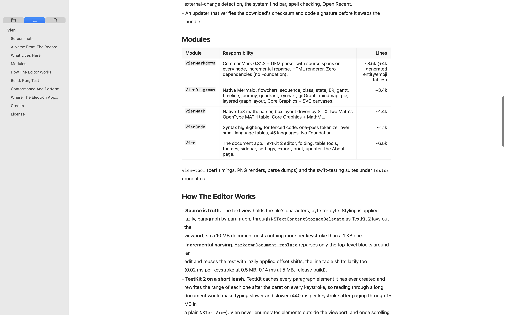
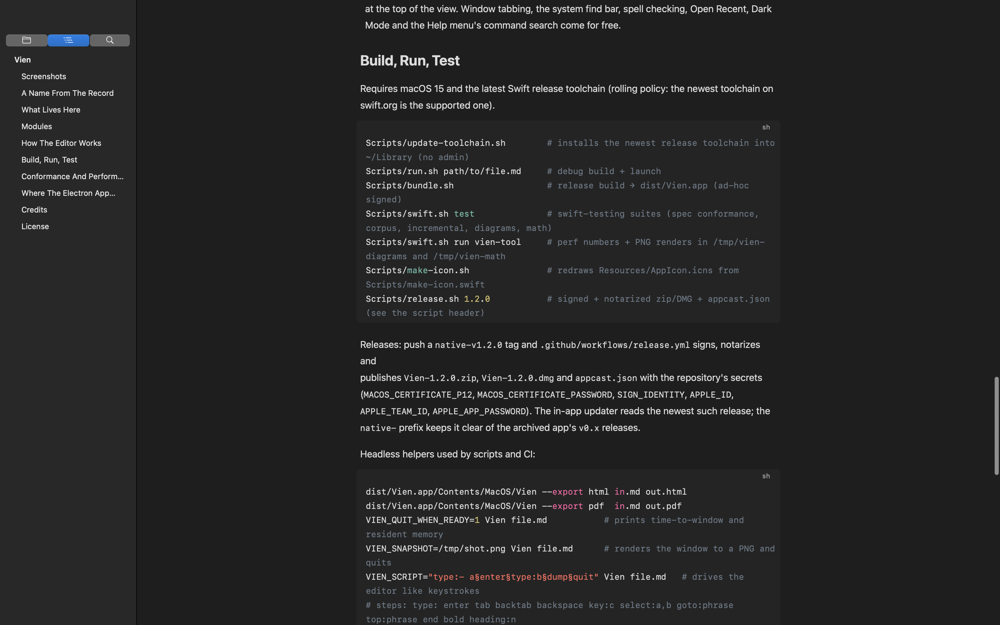
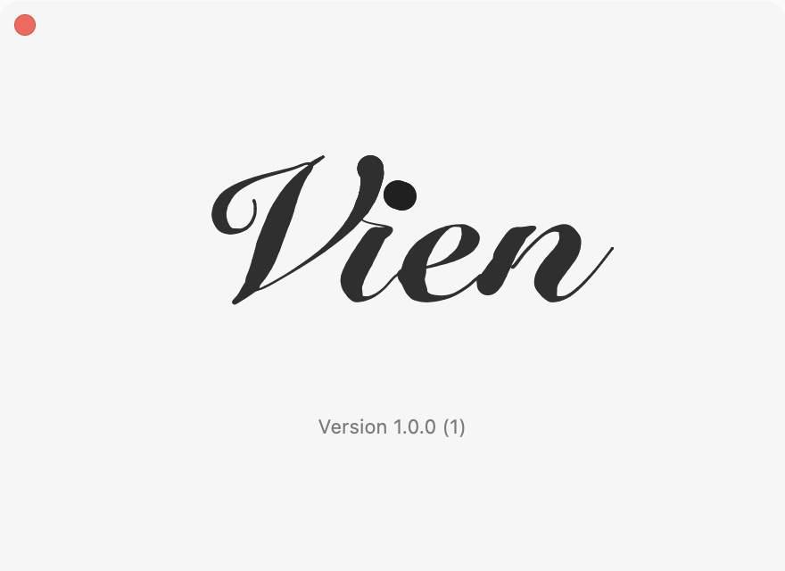

# Vien

Vien is a Markdown editor for long stretches of attention, built for the Mac and nothing else.

No split preview. No busy dashboard. No productivity theater. One continuous surface for writing,
reading, revising and exporting, drawn entirely by AppKit, Core Text and Core Graphics from the
Markdown source. No Electron, no WebKit, no JavaScript, no third-party packages. The whole app is
3.6 MB, opens a 15 MB document in under a second, and never rewrites a byte of your text behind
your back.

Its tone comes from Ludwig Wandinger's [*Is Peace Wild?*](https://ludwigwandinger.bandcamp.com/album/is-peace-wild-2):
spacious, nocturnal, restrained, and emotionally clear.

## Screenshots







## A Name From The Record

Vien takes its name from the track `Vien` on *Is Peace Wild?*.

That album never rushes to prove anything. It moves in low light, leaves room around each
gesture, and lets tension stay gentle instead of turning it into noise. That felt like the right
instinct for a writing tool.

So this project is not trying to look "efficient" at every second. It is trying to feel settled.
Quiet, but not empty. Precise, but not cold. Something closer to a clear desk at night than a
dashboard full of controls.

## What Lives Here

- One editing surface: styled source. Outside the block you are editing, markup folds away and the
  page reads like a finished document; click anywhere and the source under the caret shows itself.
- CommonMark 0.31.2 and GitHub Flavored Markdown, with footnotes, math, emoji and front matter.
- Fenced code coloured for 45 languages; Mermaid diagrams and TeX math rendered natively, in place.
- Tables edited as tables, shown as a grid; a Table menu for rows, columns and alignment.
- A full-height sidebar with files, outline and search; Quick Open; window tabs.
- Focus Mode, Typewriter Mode, Source Code Mode; seven themes that follow or set the appearance.
- HTML and PDF export, printing, and the same headless from the command line.
- `NSDocument` underneath: autosave, versions, crash recovery, rename from the title bar,
  external-change detection, the system find bar, spell checking, Open Recent.
- An updater that verifies the download's checksum and code signature before it swaps the bundle.

## Modules

| Module | Responsibility | Lines |
| --- | --- | ---: |
| `VienMarkdown` | CommonMark 0.31.2 + GFM parser with source spans on every node, incremental reparse, HTML renderer. Zero dependencies (no Foundation). | ~3.5k (+4k generated entity/emoji tables) |
| `VienDiagrams` | Native Mermaid: flowchart, sequence, class, state, ER, gantt, timeline, journey, quadrant, xychart, gitGraph, mindmap, pie; layered graph layout, Core Graphics + SVG canvases. | ~3.4k |
| `VienMath` | Native TeX math: parser, box layout driven by STIX Two Math's OpenType MATH table, Core Graphics + MathML. | ~1.4k |
| `VienCode` | Syntax highlighting for fenced code: one-pass tokenizer over small language tables, 45 languages. No Foundation. | ~1.1k |
| `Vien` | The document app: TextKit 2 editor, folding, table tools, themes, sidebar, settings, export, print, updater, the About page. | ~6.5k |

`vien-tool` (perf timings, PNG renders, parse dumps) and the swift-testing suites under `Tests/`
round it out.

## How The Editor Works

* **Source is truth.** The text view holds the file's characters, byte for byte. Styling is applied
  lazily, paragraph by paragraph, through `NSTextContentStorageDelegate` as TextKit 2 lays out the
  viewport, so a 10 MB document costs nothing more per keystroke than a 1 KB one.
* **Incremental parsing.** `MarkdownDocument.replace` reparses only the top-level blocks around an
  edit and reuses the rest with lazily applied offset shifts; the line table shifts lazily too
  (0.02 ms per keystroke at 0.5 MB, 0.14 ms at 5 MB, release build).
* **TextKit 2 on a short leash.** TextKit caches every paragraph element it has ever created and
  rewrites the range of each one after the caret on every keystroke, so reading through a long
  document would make typing slower and slower (440 ms per keystroke after paging through 15 MB in
  a plain `NSTextView`). Vien never enumerates elements outside the viewport, and once scrolling has
  created a couple of thousand elements it drops them again with a whole-document attribute
  invalidation, anchored so the view does not move. Typing stays at a few milliseconds whatever has
  been read.
* **Markup folds away.** Outside the block being edited, markup is hidden (hairline transparent
  font, nothing rewritten) and each fragment draws what it stood for: heading hashes vanish, `>`
  becomes a bar with the text set in from it, `-` becomes a bullet (•, ◦, ▪ by depth) drawn over
  the transparent marker, fences collapse into the padding of a code background whose header strip
  carries the language tag, `---` becomes a rule, blank lines become half-height gaps, inline code
  sits in a rounded box, a hard line break shows a small ↓, links show their text, images show in
  place, tables become a native grid with wrapped cells. The line under the caret always shows its
  true size. Settings › Editor › Markup turns this off; Source Code Mode shows everything.
* **Diagrams and math draw themselves.** A Mermaid fence or a `$$` block gets a custom
  `NSTextLayoutFragment` that reserves space and draws the rendered bitmap beneath the closing line;
  the text stays editable above it. Rendering is synchronous native code (5–20 ms per diagram,
  <2 ms per formula) with an in-memory cache.
* **Tables are edited as tables.** The Table menu (also in the context menu) inserts, formats, adds,
  moves and deletes rows and columns and sets alignment; the model is read from the raw rows, so
  escaped pipes, extra cells and list or quote prefixes survive. Tab and Shift-Tab move between
  cells, add a row from the last cell.
* **Code is coloured.** `VienCode` tokenizes a fenced block once per edit (comments and strings
  may span lines) and the styler colours each line; the same tokens drive HTML export and printing.
* **Themes.** System (follows macOS), Paper, Graphite, Solarized Light and Dark, Nord, One Dark.
  A fixed palette also sets the window appearance so chrome and text agree; printing always uses
  the system palette.
* **About Vien is written by hand.** The panel is a blank page on which a pointed pen writes the
  wordmark: the pen's route and the width at every point were traced from the medial axis of the
  icon's letters (Snell Roundhand Black), so what appears is the icon, stroke by stroke, with wet
  ink that dries to the label colour. The pen spends its time in proportion to pressure, so heavy
  strokes are pressed slowly and hairlines fly. Drag on the page to write with the same pen, click
  the word to have it written again (never quite the same hand twice), hold ⌥ for the build, ⌘C
  copies it, Escape clears your ink. Dry ink is baked into a bitmap; a frame costs 0.3 ms.
* **macOS does the rest.** The sidebar is a full-height source list beside a unified toolbar, the
  title lives in the content area, and resizing the window or the sidebar never moves the paragraph
  at the top of the view. Window tabbing, the system find bar, spell checking, Open Recent, Dark
  Mode and the Help menu's command search come for free.

## Build, Run, Test

Requires macOS 15 and the latest Swift release toolchain (rolling policy: the newest toolchain on
swift.org is the supported one).

```sh
Scripts/update-toolchain.sh        # installs the newest release toolchain into ~/Library (no admin)
Scripts/run.sh path/to/file.md     # debug build + launch
Scripts/bundle.sh                  # release build → dist/Vien.app (ad-hoc signed); UNIVERSAL=1 for arm64 + x86_64
Scripts/swift.sh test              # swift-testing suites (spec conformance, corpus, incremental, diagrams, math)
Scripts/swift.sh run vien-tool     # perf numbers + PNG renders in /tmp/vien-diagrams and /tmp/vien-math
Scripts/make-icon.sh               # redraws Resources/AppIcon.icns from Scripts/make-icon.swift
Scripts/release.sh 1.2.0           # signed + notarized zip/DMG + appcast.json (see the script header)
```

Releases: push a `native-v1.2.0` tag and `.github/workflows/release.yml` builds a universal
binary (Apple silicon and Intel) and publishes `Vien-1.2.0.zip`, `Vien-1.2.0.dmg` and
`appcast.json`. With the repository's secrets (`MACOS_CERTIFICATE_P12`,
`MACOS_CERTIFICATE_PASSWORD`, `SIGN_IDENTITY`, `APPLE_ID`, `APPLE_TEAM_ID`, `APPLE_APP_PASSWORD`)
it also signs and notarizes; without them the build is ad-hoc signed and the release notes say so.
The in-app updater reads the newest such release; the `native-` prefix keeps it clear of the
archived app's `v0.x` releases.

Headless helpers used by scripts and CI:

```sh
dist/Vien.app/Contents/MacOS/Vien --export html in.md out.html
dist/Vien.app/Contents/MacOS/Vien --export pdf  in.md out.pdf
VIEN_QUIT_WHEN_READY=1 Vien file.md           # prints time-to-window and resident memory
VIEN_SNAPSHOT=/tmp/shot.png Vien file.md      # renders the window to a PNG and quits
VIEN_SCRIPT="type:- a§enter§type:b§dump§quit" Vien file.md   # drives the editor like keystrokes
# steps: type: enter tab backtab backspace key:c select:a,b goto:phrase top:phrase end bold heading:n
#        bullets quote undo wait:ms pagedown:n action:selector: clicktable:r,c inserttable:r,c
#        theme:name update:check|install recycle snap:path snapkey:path window:w,h stats undoinfo
#        sidebar:files|outline|search|hide fullscreen doodle activate dump selection time quit
# type: inserts text outside an event, so it does not close the undo group or mark the document
# edited; use key: for a real key event. quit clears change counts, so scripted edits are discarded.
# time prints how long the previous step took; after pagedown it also splits layout (and the
# styling inside it) from drawing. NSUserDefaults arguments work: Vien -sourceMode 0 file.md;
# add -ApplePersistenceIgnoreState YES so a scripted run does not also restore last session's windows.
```

## Conformance And Performance

Release build, 2020 Intel MacBook, Swift 6.3.3.

| Check | Result |
| --- | --- |
| CommonMark 0.31.2 examples | 652 / 652 |
| GFM 0.29 examples | 28 / 28 |
| Lossless corpus | 35 / 35 fixtures byte-identical, spans cover every byte |
| Incremental vs full reparse | 2,160 random edits identical (36 documents × 60 edits) |
| Block parse | ~70 ms / MB |
| Keystroke reparse (parser only) | 0.02 ms (0.5 MB) · 0.14 ms (5 MB) |
| Keystroke in the editor (insert, reparse, relayout) | 2–6 ms from 0.6 MB to 15 MB, unchanged after reading the whole document |
| Keystroke inside a 3,000-line code block | 5 ms (CSS) · 10 ms (JavaScript), retokenized in full each time |
| Page down in a 1 MB document (1100×900 window, ~38 paragraphs laid out and drawn) | 16 ms, of which styling 2 ms; the same on page 2 and page 400 |
| HTML render | ~150 ms / MB |
| App bundle | 3.6 MB (with icon) |
| Launch to editable window | 0.35 s (1 KB file) · 0.42 s (0.6 MB) · 0.57 s (5.3 MB) · 0.96 s (15 MB) |
| Resident memory after opening | 50 MB (1 KB) · 62 MB (0.6 MB) · 125 MB (5.3 MB) · 259 MB (15 MB) |
| Mermaid render | 5–20 ms per diagram · TeX formula < 2 ms |

Only the paragraphs on screen are styled, at launch and ever after; everything else is built as it
scrolls into view, which is what keeps the numbers flat as documents grow.

## Where The Electron App Went

Vien began as a fork of [MarkText](https://github.com/marktext/marktext), an Electron app. That
lineage is archived, intact, on the branch [`archive/electron`](https://github.com/L0stInFades/vien/tree/archive/electron)
and at the tag `electron-final`; its history is part of this repository. The native app is the
only Vien from here on.

## Credits

- The Markdown lineage of [MarkText](https://github.com/marktext/marktext)
- Named in response to [Ludwig Wandinger](https://www.ludwigwandinger.com/) and [*Is Peace Wild?*](https://ludwigwandinger.bandcamp.com/album/is-peace-wild-2)

## License

[MIT](LICENSE)
