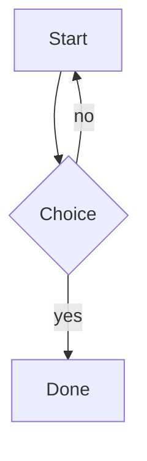
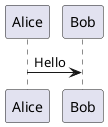

# Diagrams


```mermaid
graph TD
  A[Start] --> B{Choice}
  B -->|yes| C[Done]
  B -->|no| A
```

```vega-lite
{
  "mark": "bar",
  "data": {"values": [{"a": 1}]}
}
```


```plantuml
@startuml
Alice -> Bob: Hello
@enduml
```
